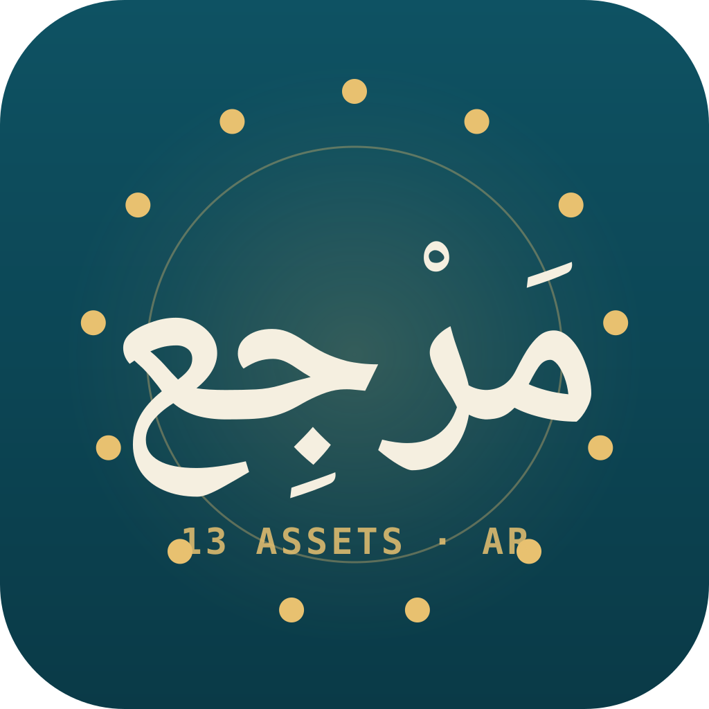

<p align="center">
  
</p>

# مجموعة أدوات المُدوَّنة العربية

> 🇬🇧 [English README](README.md) — هذا الملف هو النسخة العربية، صياغةً بالعربية الفصحى لا ترجمةً حرفية.

البنيةُ التحتيةُ اللغويةُ المشتركةُ لعائلةٍ من أربع مهارات عربية: قاموسُ الترجمة الحرفية ← الطبيعية، وسياساتُ السجل، وإحصاءاتُ المُدوَّنة، و**١٣ أصلًا بيانيًّا** مُدارًا بترقيمٍ دلاليٍّ مستقلٍّ لكلِّ أصل. هذه المجموعةُ هي **طبقةُ البيانات والمرجع** التي تقرأ منها المهاراتُ الأخرى (المؤنسِن، والمترجم، وجناح التأليف) — وليست مؤنسِنًا ولا مترجمًا بذاتها. مبنيةٌ على مواصفات [Agent Skills](https://agentskills.io)؛ بايثون ٣ من المكتبة القياسية فحسب، بلا أيِّ `pip install`.

## الجديد في v1.13.0 — عقد المرونة المشترك `safe_llm_call`

`scripts/safe_llm_call.py` يَشحَن عقدًا مشتركًا للتعامل مع أعطال مزوِّدي النماذج اللغوية، تَتبنَّاه المهاراتُ الثلاثُ التي تُجري نداءاتٍ للنماذج (المترجم v1.9.0، والمؤنسِن v2.17.0، وجناح التأليف v1.8.0):

- **لا يَرفَع استثناءً أبدًا** — المُستهلِكُ يَفحَص `‎.ok`؛ كلُّ عطلٍ يَعود مُغلَّفًا في `LLMCallResult` ببنيةٍ منظَّمة (`error_class`، `attempts`، `latency_ms`، `circuit_open`، `http_status`).
- **قاطعُ دارةٍ لكلِّ مزوِّد** (ثلاثةُ إخفاقاتٍ متتالية ← فتحٌ لـ٦٠ ثانية) + إعاداتُ محاولةٍ بتراجعٍ أُسِّي محدود.
- أصنافُ الأعطال الحتميةُ (`http_4xx`، `json_decode`، `schema_mismatch`، `empty_response`) لا تُعاد محاولتُها.

يُغطِّيها `evals/test_safe_llm_call.py` بـ١٢ تأكيدًا (نقطةُ نهايةٍ غيرُ قابلةٍ للوصول لا تَرفَع استثناءً، فتحُ القاطع وإعادةُ تعيينه، حدُّ الإعادات، حِملٌ غيرُ قابلٍ للترميز).

## العقودُ الأربعةُ الأساسية (G1–G4)

| العقد | الملف | الدور |
|---|---|---|
| **G1** | `scripts/arabic_normalize.py` | تطبيعُ يونيكود العربي — ثلاثةُ مستويات (خفيف/متوسط/جذري)، مُتحقَّقُ التَّماثُل (idempotent) والاطِّراد |
| **G2** | `scripts/asset_registry.py` | سجلُّ نُسَخِ الأصول — تحليلُ مدًى بنمط npm، تقريرُ `check_consumer()` |
| **G3** | `scripts/influence_telemetry.py` | `InfluenceTrace` — سجلٌّ سببيٌّ إلحاقيٌّ لأثر كلِّ أصلٍ على المُخرَج |
| **G4** | `install_family.py` | مُثبِّتٌ عابرٌ للمنصَّات يَجلُب الأشقَّاء الناقصين ويتحقَّق من التثبيت |

## ما الذي تَقرأه المهاراتُ من هنا

- **قاموسُ الترجمة الحرفية ← الطبيعية** (الأصل A) — ٣٤٠ مدخلًا مُتحقَّقًا منه إحصائيًّا.
- **مرشَّحاتُ المصطلحات** (الأصل F) ومصطلحاتُ المجالات المُزدوجة EN↔AR (الأصل G) — تشمل ١٣ أصلَ مجال، منها مصطلحاتُ الأعمال والقانون والسياسة المُستخرَجةُ من مُدوَّنة SPA-2024 ومُرتَّبةٌ بإجماع ثلاثة مزوِّدين مستقلِّين.
- **سياساتُ السجل** والجداولُ المعجمية وقواعدُ الطباعة.

## التحقق من سلامة التثبيت

```bash
python evals/contract_conformance.py    # ٥٦/٥٦ — كلُّ مُستهلِكٍ يتبنَّى G1–G4
python evals/golden_e2e_test.py          # ٤٠/٤٠ — مسارُ العائلة سليم
python evals/test_safe_llm_call.py       # ١٢/١٢ — عقدُ المرونة
python evals/test_public_api_units.py    # ٢٨ — واجهاتُ القراءة العامة
python evals/test_arabic_normalize_units.py  # ٤٦ — عقدُ التطبيع G1
```

كلُّها بايثون ٣ من المكتبة القياسية، بلا اعتمادٍ خارجي.

## النطاق

طبقةُ بياناتٍ ومرجعٍ للقراءة فحسب (مع أداةِ `safe_llm_call`). **لا تَستخدمها** للتحويل النصيِّ المباشر (استخدم المؤنسِن)، ولا للترجمة (استخدم المترجم)، ولا لتوليد المحتوى (استخدم جناح التأليف). تاريخُ الإصدارات الكاملُ في [`CHANGELOG.md`](CHANGELOG.md).

## الترخيص

[MIT](LICENSE). حقوق النشر © ٢٠٢٦.
